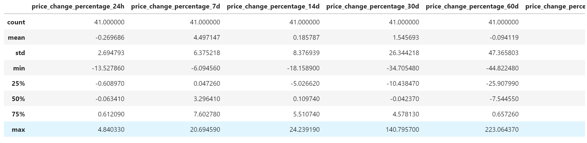

# Cryptocurrency Portfolio Proposal
The purpose of this challenge is to utilize Python and unsupervised learning methods to assemble cryptocurrency portfolios by their performance in different time periods.


---

## Technologies

The cryptocurrency portfolio proposal leverages Python 3.8+ and utilizes the following project libraries and dependencies:
* [JupyterLab](https://jupyterlab.readthedocs.io/en/stable/) - a single integrated development environment (IDE) that allows you to write and run Python programs and review the results in one place
* [Pandas](https://pandas.pydata.org/) - a software library designed for open source data analysis and manipulation
* sci-kit learn - KMeans, PCA, and StandardScaler 
* pathlib
* hvplot


---

## Installation Guide


Download Anaconda for your operating system and the latest Python version, run the installer, and follow the steps. Restart the terminal after completing the installation. Detailed instructions on how to install Anaconda can be found in the [Anaconda documentation](https://docs.anaconda.com/anaconda/install/).

Install sci-kit learn

Sci-kit learn is automatically installed with Anaconda. However, if it is not installed on your machine to install this library, run the following command in your terminal:

```python
pip install -U scikit-learn
```


---

## Usage
The analysis is hosted on the following GitHub repository at: https://github.com/nguyenthuyt/crypto_investments   

### **Run instructions:**
To run this analysis, simply clone the repository or download the files and launch the **crypto_investments.ipynb** in JupyterLab

To launch JupyterLab, follow these steps:

In your open terminal window (Terminal for macOS or Git Bash for Windows), navigate (`CD`) to the repo directory and then confirm that the term (dev) appears at the beginning of your command prompt. Type:
```python
conda activate dev
```

Then type: 
```python
jupyter lab
```

An instance of the JupyterLab user interface automatically opens in your browser. On the left-hand side menu, double-click the **crypto_investments.ipynb** file to open the notebook.

Navigate to **'Run'** on the menu bar and select **'Run All Cells'** from the drop-down menu. Otherwise, run each individual cell with ctrl+enter.


If running each cell individually, first run the cell to import the required libraries and dependencies: 


### **Step 1: Import the cryptocurrency dataset with periodic performance metrics.**
Before using, it is required to load market data. In this analysis the market data is loaded by running `pd.read_csv' using the data from 'crypto_market_data.csv' stored in the Resources folder. To import the data, type:

`pd.read_csv(
    Path("Resources/crypto_market_data.csv"),
    index_col="coin_id")`


To confirm the data was imported properly, use the head and/or tail function to review the data:

`display(df.head())`

`display(df.tail())`

----

### **Step 2: Identify which periodic performance metrics relate the most to clustering.**

In this section, you will generate the summary statistics, and use HvPlot to visualize your data to observe what your DataFrame contains.

(1) Generate summary statistics using the 'describe' function.

```python
df.describe()
```


(2) Using hvPlot, create an interactive line plot to see what is in the DataFrame


(3) Use StandardScaler along with 'fit_transform' to normalize the CSV data. Then, create a DataFrame containing the scaled data.


### **Step 3: Find a reasonable cluster size.**

In this step, you will use the elbow method to find the best value for k.

(1) Code the elbow method algorithm to find the best value for k. Use a range from 1 to 11.

```python
k = list(range(1, 11))
inertia=[]
for i in k:
    model = KMeans(n_clusters=i, random_state=0)
    model.fit(df_market_data_scaled)
    inertia.append(model.inertia_)
```

(2) Plot a line chart with all the inertia values computed with the different values of k to visually identify the optimal value for k.


According to the above elbow curve, the optimal value for k is 4.

### **Step 4: Cluster the data by using the K-means algorithm on the most important performance metrics**

In this step, you will use the K-Means algorithm with the best value for k found in the previous section to cluster the cryptocurrencies according to the price changes of cryptocurrencies provided.

Create a scatter plot showing the four clusters using hvPlot by setting x="price_change_percentage_24h" and y="price_change_percentage_7d". 


### **Step 5: Optimize Clusters with Principal Component Analysis (PCA)**

In this section, you will perform a principal component analysis (PCA) and reduce the features to three principal components. 

(1) The three component dimensionality reduction perserved an explained variance of 89.5% and is attributed to each component as follows in the below array:


(2) Again the elbow method is applied to PCA DataFrame and resulted in an optimal k value of 4.


(3) Using the k value of 4, a scatter plot is created to visualize the clusters.


### **Step 6: Graph and interpret the results**

After analyzing the elbow curve and cluster plots from the original DataFrame and the PCA DataFrame with fewer features, the value of k remained the same but the resulting PCA scatterplot had tighter segmented clusters with smaller variances between the centroid and the data points.

-------

### **Quit instructions:**
After saving the file, from the menu bar, navigate to **'File'**, select **'Shutdown'** from the drop-down menu and confirm Shut Down.


In your open terminal window, deactivate the dev environment by typing:
```python
conda deactivate
```

---

## Contributors

This project was created as part of the Rice Fintech Bootcamp 2022 Program by:

Thuy Nguyen

Email: nguyen_thuyt@yahoo.com

LinkedIn: nguyenthuyt


---

## License

MIT
